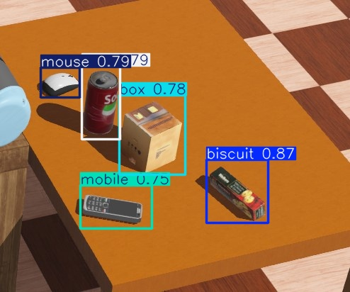
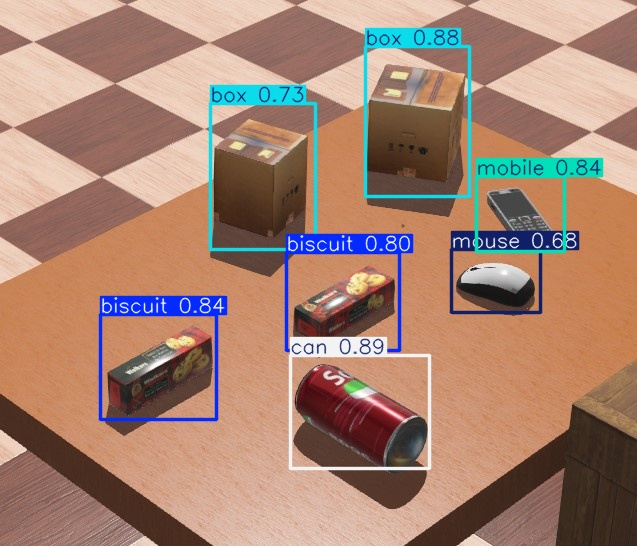

# YOLOv8-Object-Detection
# ⚡ YOLOv8 Object Detection Pipeline (Colab/Drive)

This repository outlines the configuration and execution of a comprehensive **YOLOv8** object detection pipeline for custom dataset training, validation, and inference, run entirely within the **Google Colab** environment with data stored on **Google Drive**.

---

## ✨ Project Summary

The core script implements the full lifecycle of a computer vision model using the `ultralytics` library:

* **Model:** Uses the efficient **YOLOv8n** architecture.
* **Environment:** Integrates Google Colab for accelerated computing with direct access to data via Google Drive.
* **Training:** The model is trained for **100 epochs** on a custom dataset (`/dataset3`) defined by the `data.yaml` configuration.
* **Evaluation:** Includes dedicated steps for model validation and loading the `best.pt` weights for final predictions.
* **Inference:** Performs detection on static test images and streams the process on a video file (`testvideo.mp4.webm`).

---

## 💻 Key Execution Steps

1.  **Setup:** Installs `ultralytics` and mounts Google Drive.
2.  **Training:** Executes `model.train()` with automatic saving of checkpoints (`save_period=1`).
3.  **Validation:** Runs `model.val()` on the validation set.
4.  **Prediction:** Executes `model.predict()` on a directory of images and a video file, saving results to separate output directories.
5.  **Model Re-use:** Explicitly loads the best-performing weights (`best.pt`) from the training output for final evaluation.

---

## 📂 Output Structure

All outputs (checkpoints, results, predictions) are organized within specified folders on Google Drive, such as `/content/gdrive/MyDrive/yolo_outputs` and `/content/gdrive/MyDrive/known`.

  

  

